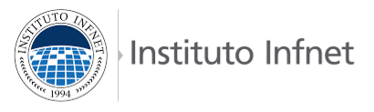

### 

**Definição do Projeto**

Projetos supervisionados em Desenvolvimento de software, apps, sites ou hardware

Aluno(a): Ana Beatriz Rangel Mattos

1. **O projeto vai ser desenvolvido individualmente, dupla ou grupo?**
   Individualmente.

2. **Definição do tema do trabalho.**
   Website para auxiliar estudantes do ENEM.

3. **Descreva o projeto.**

   O projeto tem o objetivo de construir um website que sirva como um ferramenta educacional para auxiliar estudantes a se prepararem para o ENEM, utilizando questões de provas anteriores.

   Entre as principais funcionalidades, o sistema permitirá filtrar questões por ano, área de conhecimento e idioma (inglês ou espanhol). O aluno poderá responder às questões em modo de estudo ou simulado, acompanhando seu desempenho por meio de estatísticas simples, como percentual de acertos por área.

   O website oferecerá um cronograma semanal de estudos, no qual o aluno poderá se organizar de acordo com sua disponibilidade, distribuindo questões ao longo dos dias relacionadas à área que está no cronograma.

   Como funcionalidade adicional, o aluno poderá definir a meta de aprovação (curso e universidade de interesse) para auxiliar na visualização do progresso em relação ao objetivo.

4. **Quem será o cliente?**

   O projeto não terá um cliente formal. O público-alvo serão estudantes do ensino médio e candidatos ao ENEM que buscam uma forma mais organizada e acessível de estudar.

   Esses usuários poderão testar a plataforma e fornecer feedback final sobre usabilidade, clareza das funcionalidades e utilidade prática do sistema.

5. **Como esse trabalho beneficiará a comunidade em geral?**

   O projeto beneficiará a comunidade ao oferecer uma ferramenta gratuita e acessível de apoio aos estudos para o ENEM, contribuindo para a democratização do acesso a recursos educacionais.

6. **Quais serão os critérios técnicos? Linguagem? Framework?**

- Front-End
  - Linguagem: TypeScript
  - Biblioteca: React
  - Estilização: Tailwind CSS
  - Biblioteca de Componentes: shadcn/ui ou daisyUI
- Back-End
  - Linguagem: C#
  - Framework: ASP.NET Core e Entity Framework Core.

O back-end será responsável pela lógica da aplicação, integração com a API de questões do ENEM, gerenciamento de usuários, armazenamento de progresso, cronogramas e resultados de simulados.
