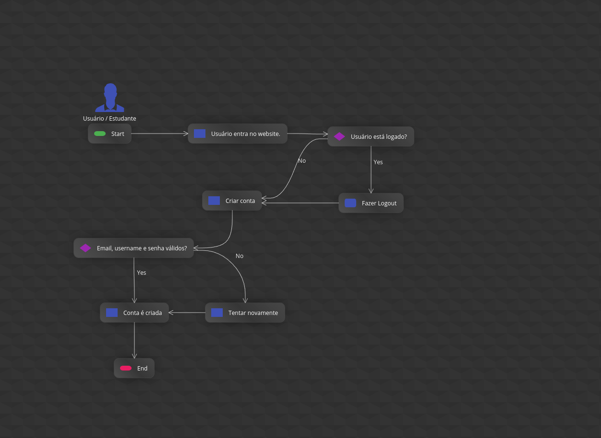
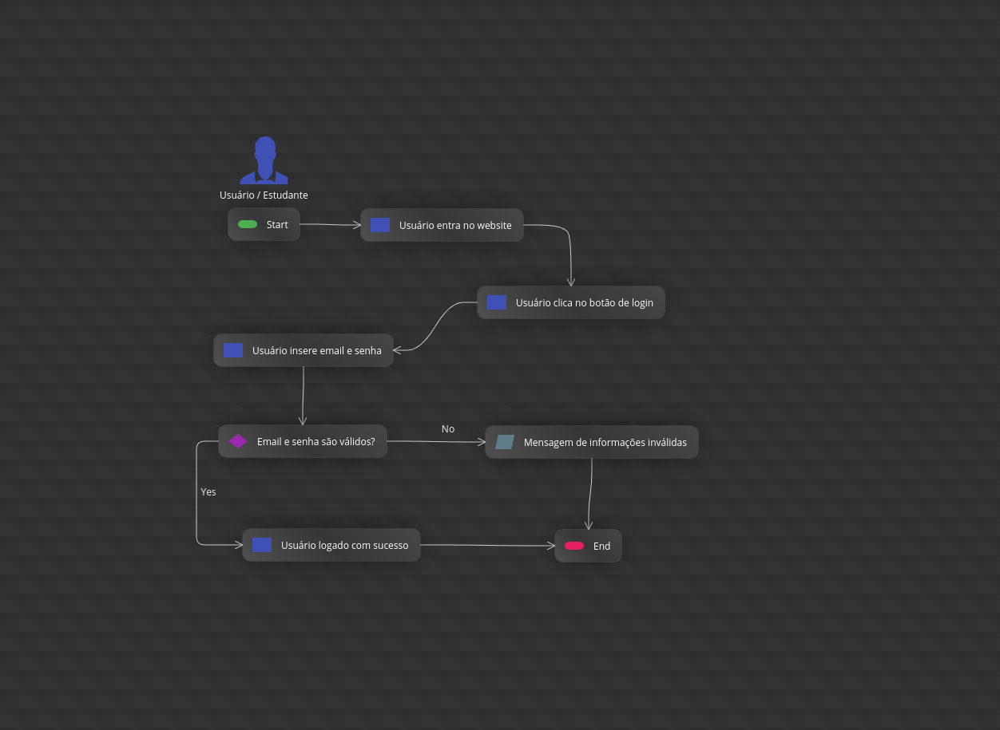
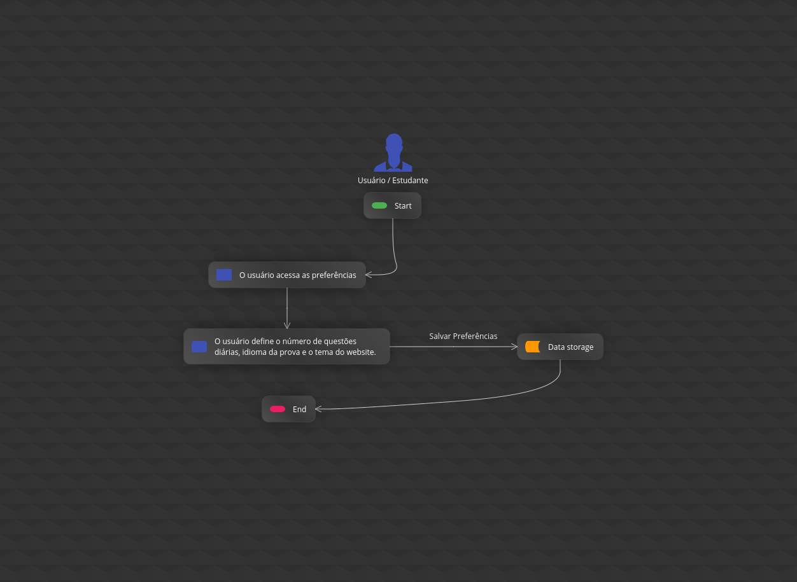
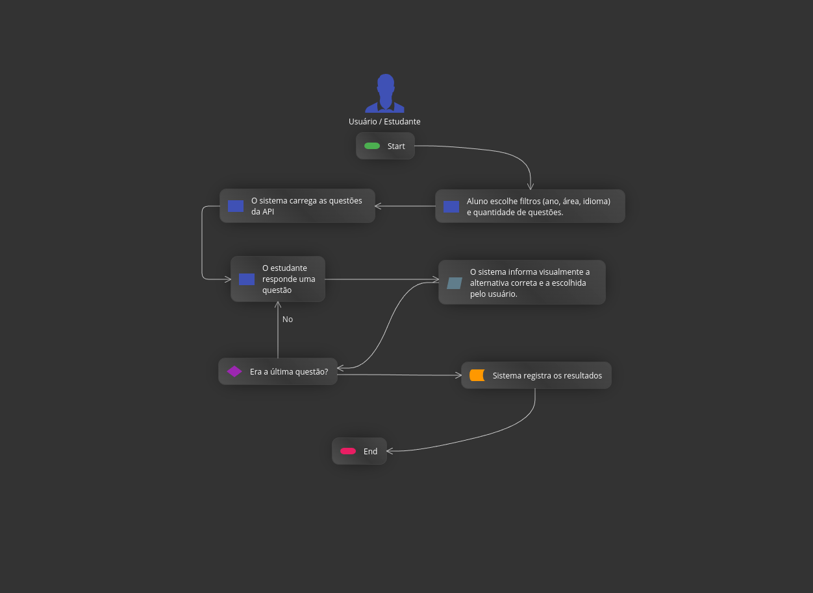
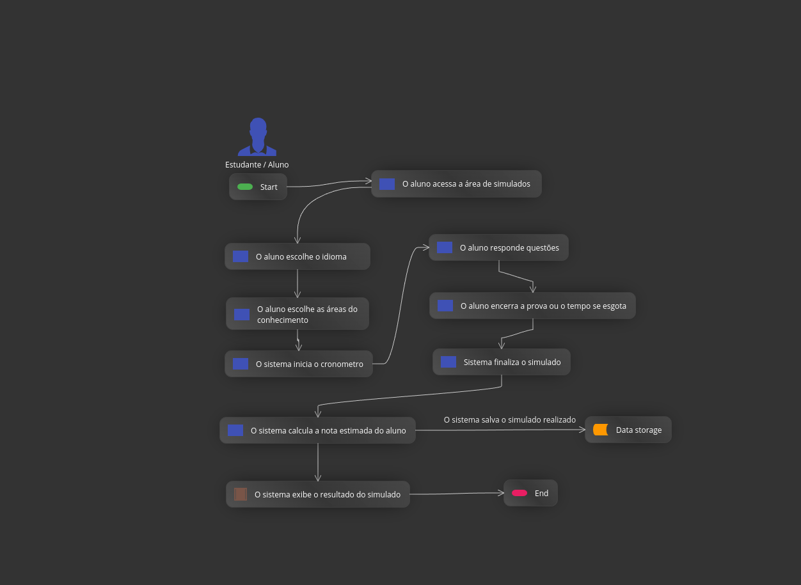
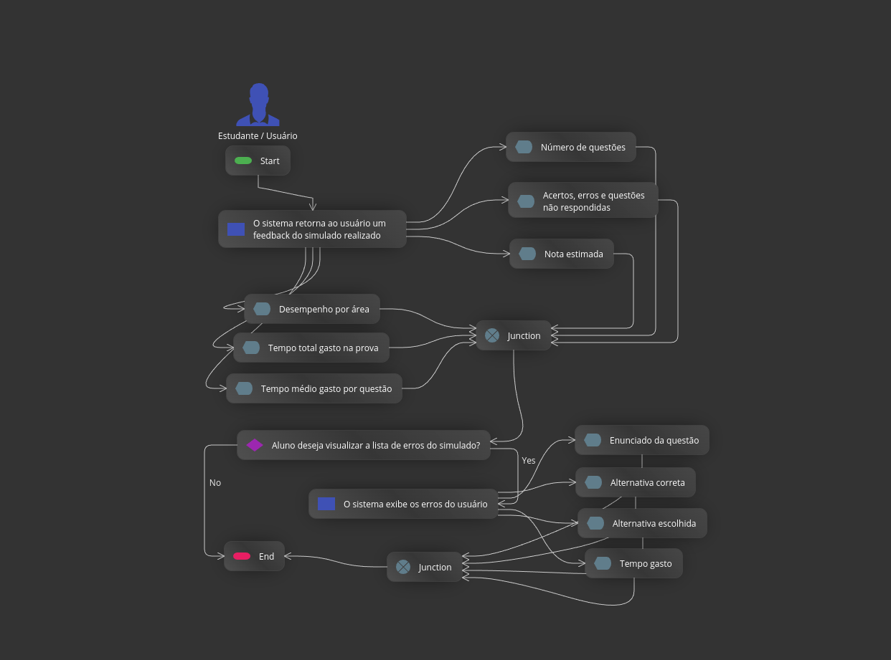

# Diagramas de Atividades

Foram utilizados diagramas de atividades para representar o fluxo de execução das principais funcionalidades do sistema, detalhando as ações do usuário e as respostas do sistema. Esses diagramas complementam o diagrama de casos de uso, permitindo uma melhor compreensão do comportamento do sistema durante sua execução.

## UC 01 - Cadastro de Usuário

## UC 02 - Usuário faz login

## UC 03 - Atualizar preferências de Usuário

## UC 04 - Resolver questões em modo estudo livre

## UC05 – Realizar simulado

## UC06 - Visualizar Resultado do Simulado

